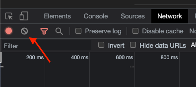
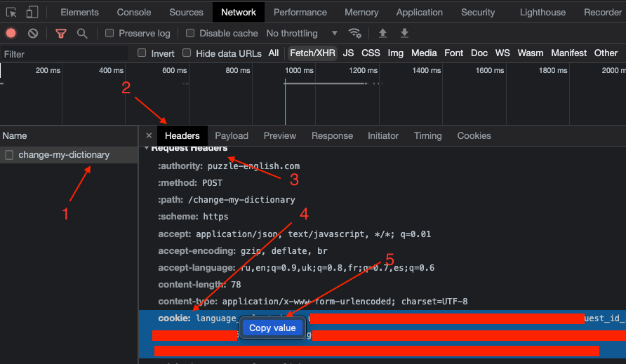

# Puzzle-english vocabulary parser

Puzzle-english vocabulary parser is application writes on Golang for export vocabulary from Puzzle-english site.

## Download
[MacOS](https://github.com/lutogin/go-puzzle-english-vocabulary-parser/builds/mac-os/go-puzzle-english-vocabulary-parser)

[Windows](https://github.com/lutogin/go-puzzle-english-vocabulary-parser/builds/windows/go-puzzle-english-vocabulary-parser.exe)

[Linux](https://github.com/lutogin/go-puzzle-english-vocabulary-parser/builds/linux/go-puzzle-english-vocabulary-parser)

## Build
For manually building just download the repo and run build command.

MacOS
```bash
GOOS=darwin GOARCH=amd64 go build -o builds/mac-os/
```

Windows
```bash
GOOS=windows GOARCH=amd64 go build -o builds/windows/
```

Linux
```bash
GOOS=windows GOARCH=amd64 go build -o builds/windows/
```

## Usage

Unfortunately, for usage you should to pass you cookie from https://puzzle-english.com

For it follow the next steps:
* Login to you account at https://puzzle-english.com
* Go to the page https://puzzle-english.com/change-my-dictionary
* Open developer tools (https://support.google.com/campaignmanager/answer/2828688?hl=en)
* Go to tab "Network"
* Click on "Clear" button.

* Click on the button on webpage `Показать еще/Show more`
* There will appear new log in Network section
* Choose this item > Click to `Header` > Find and open `Request headers` > Find section `cookie` > Right click on it > `Copy value`

* That's it. You can run app.

There aren't extra validations, so be careful with passed data.

## Vocabulary

After the application running there will be created a new file `vocabulary.csv` in the same place where were run app, with all your dictionary.

## Contributing

Pull requests are welcome. For major changes, please open an issue first
to discuss what you would like to change.

Please make sure to update tests as appropriate.

## License

[MIT](https://choosealicense.com/licenses/mit/)